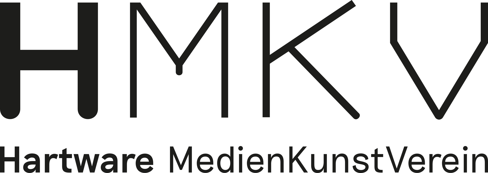

# **Training the Archive**


## **Overview**
The Curator's Machine was developed in a cooperation between the Visual Computing Institute of the RWTH Aachen University and the Ludwig Forum Aachen, in conjunction with the HMKV Hartware MedienKunstVerein, Dortmund.. <br>

It is a tool that assists curators by utilizing either OpenAI's CLIP model or the OpenCLIP model and provides an AI-guided search that is able to...:

- ... adapt the search results to the current session to suggest images that fit the project at hand
- ... search your own image collection
- ... search with an intuitive and user-defined description (e.g., a dog in front of a tree)
- ... search by image to get similar images
- ... filter the search based on metadata
  
## **About**

### Collaboration partners: <br>

<p float="left">
  
</p>
<p float="left">
  
</p>

### Digital partner: <br>

<p float="left">
  
</p>


### Funded in the program: <br>

<p float="left">
  
</p>

### Funded by: <br>

<p float="left">
  
</p>

## **Installation**

To install the tool, you have two options:

1.) Clone the GitHub repository and set up a Python environment using the packages from the `requirements.txt` file and run `TheCuratorsMachine.py` file.

2.) Download and run one of the available installers for your operating system.

### **Installers**

- Windows - [Download]()
- macOS (Apple Silicon) - [Download]()
- macOS (Intel) - [Download]()

## **Getting started**

### **First steps**
<!---
Add descriptions about the UI elements in the startup screen image?
Need to zoom in more in order for this to work, perhaps show less of the canvas.
Basically equivalent to the tutorial?
-->

<p align="center">
  
</p>

You can start typing a search prompt into the search bar and press Enter to search for images.
Then you can drag and drop or double-click an image to add it to the canvas. 
By default, a small set of images is provided for you to try out the application. <br>
**Note**: Since this set of images is a small demo set, there may not be a suitable image for every search query. 

To explore the tool further, you can use the built-in tutorial in the "Help" menu found in the menu bar.

### **Use your own images**

You can use your own images in the tool by linking your own dataset. <br>
To do this, use the "Change Dataset" option in the "File" menu of the menu bar to open a dialog, where you have the option to link a new dataset with your own images. <br>
For the generation, the tool needs the following paths:

- Image directory: This has to be a path to a directory with the images you want to use. <br>
Currently the following file formats are supported: `.jpg`, `.png`, `.tga` <br>
**Note**: Subdirectories are not supported!
- Metadata file: This has to be a path to a `.csv` file containing metadata about the images located in the given "Image directory." <br>
**Note**: A default preprocessing is applied that works properly, if a column named "Obj_ Id_" is provided.

**Note**: To correctly link the metadata to the corresponding images, the processed csv. file must contain a column named `encoding_id` that contains the index of the image in the dataset. <br>
As inspiration for processing your own metadata file, you can use the following code: <br>
```python
from data import ImageDataset
import pandas as pd

df = pd.read_excel('<meta data file path>')
df["encoding_id"] = -1

dataset = ImageDataset('<image directory path>', None)

for i in range(len(dataset)):
    file_name = dataset.image_paths[i].split("/")[-1].split(".")[0]
    
    try:
        frame = df[df["<column that matches the file names>"] == file_name]
    except:
        continue
        
    if not frame.empty:
        df.at[frame.index[0], "encoding_id"] = i

df.to_csv('./meta_data.csv', index=False)
```
**Note**: For this to work, you may need to use a "dummy" metadata file to generate the dataset and get the index of the images, and then replace the dummy file with the processed file. <br>

For an example, see the sample metadata in the `./dataset/example directory`.

## **Dependencies**

This tool was built using Python 3.10 and the packages (+ versions) specified in the `requirements.txt` file. <br>


## **Publication**

A paper was published and presented at the Efficient Deep Learning for Computer Vision CVPR Workshop 2023. <br>
For more information, see the [paper](https://www.graphics.rwth-aachen.de/media/papers/349/Localized_Latent_Updates.pdf).

If you want to cite this paper, you can use the following Bibtex entry
```
@inproceedings{ibing_localized,
  author       = {Moritz Ibing and
                  Isaak Lim and
                  Leif Kobbelt},
  title        = {Localized Latent Updates for Fine-Tuning Vision-Language Models},
  booktitle    = {{IEEE/CVF} Conference on Computer Vision and Pattern Recognition Workshops,
                  {CVPR} Workshops 2023},
  publisher    = {{IEEE}},
  year         = {2023},
}
```
## **License**

This software is licensed under the BSD-3 license

Copyright 2023 RWTH Aachen University

Redistribution and use in source and binary forms, with or without modification, are permitted provided that the following conditions are met:

1. Redistributions of source code must retain the above copyright notice, this list of conditions and the following disclaimer.

2. Redistributions in binary form must reproduce the above copyright notice, this list of conditions and the following disclaimer in the documentation and/or other materials provided with the distribution.

3. Neither the name of the copyright holder nor the names of its contributors may be used to endorse or promote products derived from this software without specific prior written permission.

THIS SOFTWARE IS PROVIDED BY THE COPYRIGHT HOLDERS AND CONTRIBUTORS “AS IS” AND ANY EXPRESS OR IMPLIED WARRANTIES, INCLUDING, BUT NOT LIMITED TO, THE IMPLIED WARRANTIES OF MERCHANTABILITY AND FITNESS FOR A PARTICULAR PURPOSE ARE DISCLAIMED. IN NO EVENT SHALL THE COPYRIGHT HOLDER OR CONTRIBUTORS BE LIABLE FOR ANY DIRECT, INDIRECT, INCIDENTAL, SPECIAL, EXEMPLARY, OR CONSEQUENTIAL DAMAGES (INCLUDING, BUT NOT LIMITED TO, PROCUREMENT OF SUBSTITUTE GOODS OR SERVICES; LOSS OF USE, DATA, OR PROFITS; OR BUSINESS INTERRUPTION) HOWEVER CAUSED AND ON ANY THEORY OF LIABILITY, WHETHER IN CONTRACT, STRICT LIABILITY, OR TORT (INCLUDING NEGLIGENCE OR OTHERWISE) ARISING IN ANY WAY OUT OF THE USE OF THIS SOFTWARE, EVEN IF ADVISED OF THE POSSIBILITY OF SUCH DAMAGE.